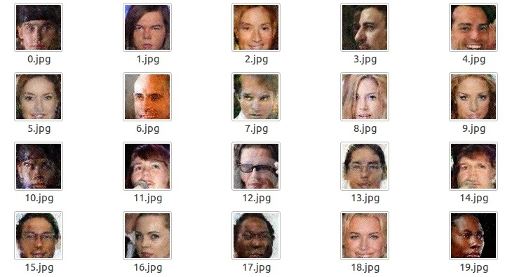

# Welcome to LaonSill framework

LaonSill is a C++ based open source software framework. LaonSill supports a wide variety of distributed GPUs and offers excellent performance in speed / memory to work well in commercial environments. LaonSill is distributed under the Apache 2.0 license and offers paid models such as subscription models with technical support for paid users. Currently, LaonSill is developing a framework to run in embedded and mobile environment and will provide functions to analyze / design using GUI.

# Installation
## Required Packages

In addition to this, there may be various libraries requried.

* OPENCV
  * http://docs.opencv.org/2.4/doc/tutorials/introduction/linux_install/linux_install.html
* CUDA 8.0
  * https://developer.nvidia.com/cuda-downloads
* CUDNN 6.0
  * https://developer.nvidia.com/cudnn
* python 2.x(we recommend above 2.7 version)
  * https://www.python.org/ftp/python/2.7.9/Python-2.7.9.tgz
* Boost Library
  * http://www.boost.org/
* GNUPlot-iostream
  * http://stahlke.org/dan/gnuplot-iostream/
* CImg
  * http://cimg.eu/
* BLAS
  * http://www.netlib.org/blas/

## Setup for Compile
Download the LaonSill framework. Then set the top directory path to `$LAONSILL_BUILD_PATH`

```
$ cd $HOME
$ git clone https://github.com/laonbud/LaonSill.git
$ export LAONSILL_BUILD_PATH=$HOME/laonsill/LaonSill
```

Make $LAONSILL_HOME in the right place. There are configuration files, log files and so on that are needed for LaonSill framework.

```
$ cd $HOME
$ mkdir LAONSILL_HOME
$ export LAONSILL_HOME=$HOME/LAONSILL_HOME
```

Copy the env.sh.eg file located in $LAONSILL_BUILD_PATH to the env.sh file. Then set the env.sh file appropriately for your environment. This env.sh file should always be run. It is recommended that you configure env.sh to run in files such as .bashrc, .bash_profile, and so on.

```
$ cd $LAONSILL_BUILD_PATH
$ cp env.sh.eg env.sh
$ vi env.sh
[env.sh example]
export LAONSILL_HOME="/home/monhoney/LAONSILL_HOME"
export INC_PATH_GNUPLOT="/home/monhoney/install/gnuplot-iostream"
export INC_PATH_CIMG="/usr/include"
export LAONSILL_SOURCE_PATH="/home/monhoney/laonsill/LaonSill/src"
export LAONSILL_BUILD_PATH="/home/monhoney/laonsill/LaonSill"
export LD_LIBRARY_PATH=$LAONSILL_SOURCE_PATH/3rd_party/nms:$LD_LIBRARY_PATH
```

## Compile
### Using NVIDIA NSIGHT
#### Auto-code generation

LaonSill framework supports a variety of automatic code generation via scripts. You must run the scripts before compiling

```
$ cd $LAONSILL_BUILD_PATH/src/param
$ ./genParam.py
$ cd $LAONSILL_BUILD_PATH/src/prop
$ ./genEnum.py
$ ./genLayerPropList.py
$ ./genNetworkProp.py
$ cd $LAONSILL_BUILD_PATH/src/log
$ ./genHotCode.py
$ cd $LAONSILL_BUILD_PATH/src/perf
$ ./genPerf.py
```

#### Compile

This project started with NSIGHT. You can compile directly with the NSIGHT by pressing build button. Please refer to the link below for the usage NSIGHT.

https://developer.nvidia.com/nsight-eclipse-edition

### Using build script

We have created out own build scripts that are independent of NSIGHT builds.

#### Prepare buildDef.json

In order to compile, you have to configure it according to your environment. We provide the buildDef.json file to accomplish that goal. Create buildDef.json from the template file(buildDef.json.eg). And then modify the buildDef.json file to suit your environment.

```
cd $LAONSILL_BUILD_PATH/build
cp buildDef.json.eg buildDef.json
vi buildDef.json
[buildDef.json]
{
    "LIBS" :
        [
            "cudart", "opencv_core", "cublas", "cudnn", "boost_system", "boost_filesystem",
            "opencv_highgui", "opencv_imgproc", "opencv_features2d", "z", "boost_iostreams",
            "X11", "gpu_nms", "lmdb"
        ],
    "LIBDIRS" :
        [
            "../src/3rd_party/nms"
        ],
    "ARCH" : "compute_60",
    "CODE" : "sm_60"
}
```

#### Run build script

You can run this script to compile. Note that the first argument of this script represents the degree of parallelism. Put the number of CPU core as an argument.

```
$ cd $LAONSILL_BUILD_PATH\build
$ ./build_only.sh 4
```

If a new file is added or there is a missing configuration in the buildDef.json file and you need to create the Makefile again, run the script below:

```
$ ./cleanBuildGen.sh
```

## Setup for running LaonSill framework
### Prepare laonsill.conf

You need to prepare the `laonsill.conf` file under `$LAONSILL_HOME`. A `laonsill.conf` file defines the settings needed to run LaonSill framework. Please refer to `$LAONSILL_BUILD_PATH/template/laonsill.conf.sample` file for basic format. See the `$LAONSILL_BUILD_PATH/src/param/paramDef.json` file for a description of each configuration parameter.

```
[laonsill.conf example]
SESS_COUNT=5
GPU_COUNT=1
JOB_CONSUMER_COUNT=6
NETWORK_SAVE_DIR=/home/monhoney/LAONSILL_HOME/network
STATFILE_OUTPUT_DIR=/home/monhoney/LAONSILL_HOME/stat
IMAGEUTIL_SAVE_DIR=/home/monhoney/LAONSILL_HOME/output_images
COLDLOG_DIR=/home/monhoney/LAONSILL_HOME/log
HOTLOG_DIR=/home/monhoney/LAONSILL_HOME/log
SYSLOG_DIR=/home/monhoney/LAONSILL_HOME/log
COLDLOG_LEVEL=0
BASE_DATA_DIR=/data
```

### Prepare cluster.conf

You need to prepare the cluster.conf file under `$LAONSILL_HOME`. The cluster.conf file defines GPU settings needed to run LaonSill framework. Please refer to `$LAONSILL_BUILD_PATH/template/cluster.conf.sample` file for basic format. The configuration file has a list value for the keyword node. One list consists of a tuple with five values. A description of each tuple value is given below:

* 1st value indicates the node ID
* 2nd value indicates server address
* 3rd value indicates server port number
* 4th value indicates GPU device ID
* 5th value indicates GPU memory size(byte)

```
{
    "node" : 
    [
         [0, "127.0.0.1", 13001, 0, 8388608000]
    ]
}
```

## Run LaonSill

After compilation, binaries can be found in the following locations:

### Using NVIDIA NSIGHT

* $LAONSILL_BUILD_PATH/Debug/LaonSillServer
* $LAONSILL_BUILD_PATH/Release/LaonSillServer
* $LAONSILL_BUILD_PATH/DebugClient/LaonSillClient
* $LAONSILL_BUILD_PATH/ReleaseClient/LaonSillClient

### Using build script

* $LAONSILL_BUILD_PATH/bin/LaonSillServerDebug
* $LAONSILL_BUILD_PATH/bin/LaonSillServer
* $LAONSILL_BUILD_PATH/bin/LaonSillClientDebug
* $LAONSILL_BUILD_PATH/bin/LaonSillClient

### show LaonSill version information

Check LaonSill version. If you have been working so far, you are ready to run LaonSill.

```
$ ./LaonSillServer -v
```

# Tutorial
LaonSill supports various boot modes. We have prepared simple tutorials for each boot mode.

## GAN for Developer Mode

Developer mode is a boot mode for experts who can use it directly while modifing the source. We have a tutorial on the GAN(Generative Adverarial Nets) algorithm. GAN is a thesis published by Ian GoodFellow in 2014 and is a very popular algorithm in image generation. We have written tutorial example code with reference to two papers:

* Generative Adversarial Networks [https://arxiv.org/abs/1406.2661]
* Unsupervised Representation Learning with Deep Convolutional Generative Adversarial Networks [https://arxiv.org/abs/1511.06434]

Let's begin. First, let's talk about the necessary files. Go the folder that contains the GAN example and check what kind of file it is.

```
$ cd $LAONSILL_BUILD_PATH/src/examples/GAN
$ ls -al
drwxrwxr-x 2 monhoney monhoney  4096  6월 30 14:44 .
drwxrwxr-x 5 monhoney monhoney  4096  6월 27 16:13 ..
-rw-rw-r-- 1 monhoney monhoney  2641  6월 27 16:13 GAN.cpp
-rw-rw-r-- 1 monhoney monhoney   343  6월 27 16:13 GAN.h
-rw-rw-r-- 1 monhoney monhoney  5738  6월 27 16:13 networkD.json
-rw-rw-r-- 1 monhoney monhoney 10958  6월 27 16:13 networkG0.json
-rw-rw-r-- 1 monhoney monhoney 11536  6월 27 16:13 networkG1.json
```

`GAN.cpp` and `GAN.h` are source and header files for GAN. `NetworkD.json`, `networkG0.json`, and `networkG1.json` are network definition files that define the GAN network. As you can guess from the name, it is in JSON format. Typical networks consist of one network definition file. There are various ways to implement, but we have prepared three networks(networkD, networkG0, networkG1) that share learning parameters to implement GAN.

Let's look at the contents of the networkD.json file. You can check multiple values for multiple layers and configs for network.

```
$ vi networkD.json
[networkD.json]
{
    "layers" :
    [
        {
            "name" : "celebAInput",
            "layer" : "CelebAInput",
            "id" : 1,
            "output" : ["data"],
            "imageDir" : "/data/celebA",
            "cropLen" : 108,
            "resizeImage" : true,
            "resizedImageRow" : 64,
            "resizedImageCol" : 64
        },

        {
            "name" : "conv1",
            "layer" : "Conv",
            "id" : 2,
            "input" : ["data"],
            "output" : ["conv1"],
            "weightFiller.type" : "Gaussian",
            "weightFiller.value" : 0.02,
            "biasFiller.type" : "Constant",
            "biasFiller.value" : 0.0,
            "filterDim.rows" : 4,
            "filterDim.cols" : 4,
            "filterDim.channels" : 3,
            "filterDim.filters" : 64,
            "filterDim.pad" : 1,
            "filterDim.stride" : 2,
            "receive" : true,
            "donatorID" : 10015
        },

        {
            "name" : "lrelu1",
            "layer" : "Relu",

                :
                :
            "biasFiller.value" : 0.0,
            "receive" : true,
            "donatorID" : 10027
        },

        {
            "name" : "celossDGAN",
            "layer" : "CrossEntropyWithLoss",
            "id" : 15,
            "input" : ["fc1"],
            "output" : ["prob"],
            "targetValue" : 1.0,
            "withSigmoid" : true
        }

    ],

    "configs" :
    {
        "batchSize" : 64,
        "epochs" : 16,
        "lossLayer" : ["celossDGAN"],
        "gamma" : 0.1,
        "saveInterval" : 1000000,
        "testInterval" : 100,
        "savePathPrefix" : "",
        "baseLearningRate" : 0.0002,
        "stepSize" : 100000,
        "weightDecay" : 0.0001,
        "momentum" : 0.9,
        "clipGradientsLevel" : 0.0,
        "gamma" : 0.1,
        "lrPolicy" : "Fixed",
        "optimizer" : "Adam",
        "beta1" : 0.5,
        "beta2" : 0.999,
        "miniBatch" : 0
    }
}
```

A network consists of a set of layers. Each layer has its own peroperties. First, let's talk about the CelebAInput layer. CelebAInput layer is a layer that manages an image dataset called CelebA[http://mmlab.ie.cuhk.edu.hk/projects/CelebA.html]. It has an attribute called imageDir, whose value is defined as /data/celebA/. The attribute indicates where the image dataset is. This means that you need to download the celebA dataset to run the GAN.

```
$ cd /
$ mkdir -p /data/celebA
and download celebA dataset into /data/celebA/
```

Below the CelebAInput layer is the convolution layer. This layer also contains several properties for performing convolution. See the $LAONSILL_BUILD_PATH/src/prop/layerPropDef.json file for information on the various layer properties.

The network properties define how many epochs the entwork will learn and how to learn using some optimizing alogorithms. As you can see in the networkD.json file, the GAN is learning using the ADAM optimizer. See the $LAONSILL_BUILD_PATH/src/prop/networkPropDef.json file for information on the various layer properties.

Since there is no useful information in the header, we will skip the header and look at the source code. We will step through the important code.

* Parse & build network

Create a network by parsing the network definition file. Perform a build operation to physically place the network(eg GPU memory allocation). Write the number of epochs to be executed in the build function as an argument.

```
#define EXAMPLE_GAN_NETWORKG0_FILEPATH              ("../src/examples/GAN/networkG0.json")
                            :
                            :
    int networkID = PlanParser::loadNetwork(string(EXAMPLE_GAN_NETWORKG0_FILEPATH));
    Network<Dtype>* networkG0 = Network<Dtype>::getNetworkFromID(networkID);
    networkG0->build(1);
```

* Train network

Learn the network. In a typical network, use the run(bool inference) function. If inference is false, learning is done; if true, inference is performed. GAN uses the runMiniBatch(bool inference, int miniBatchIdx) function because each network must be trained for each iteration.

```
    for (int i = 0; i < 10000; i++) {
        cout << "epoch : " << i << endl;
        for (int j = 0; j < miniBatchCount; j++) {

            networkG0->runMiniBatch(false, 0);
            networkD->runMiniBatch(false, j);
            networkG1->runMiniBatch(false, 0);
            networkG1->runMiniBatch(false, 0);

            if (j % 100 == 0)
                cout << "minibatch " << j << " is done." << endl;
        }
```

* Inference network

Perform an inference process to see how well GAN has been trained.

```
        networkG1->runMiniBatch(true, 0);
```

* Save image

The image information stored in the first convolution layer is saved as 20 jpeg images.

```
        ConvLayer<Dtype>* convLayer = (ConvLayer<Dtype>*)networkG1->findLayer("conv1");
        const Dtype* host_data = convLayer->_inputData[0]->host_data();
        ImageUtil<Dtype>::saveImage(host_data, 20, 3, 64, 64, "");
```

Let's run the GAN example now. Run LaonSill with the following options:

```
$ cd $LAONSILL_BUILD_PATH/bin
$ ./LaonSillServer -d GAN
[2017/06/30 16:47:54:542476(30884/0)] LaonSill engine starts
[2017/06/30 16:47:54:630809(30884/0)] enter developerMain()
[2017/06/30 16:47:55:189182(30884/0)] ***************************************************
[2017/06/30 16:47:55:189201(30884/0)] * GAN example
[2017/06/30 16:47:55:189206(30884/0)] *  - description : GAN example
epoch : 0
minibatch 0 is done.
average loss[celossGD1GAN] : 0.754151
average loss[celossGD0GAN] : 3.480695
average loss[celossDGAN] : 0.789025
minibatch 100 is done.
    :
    :
```

After a certain amount of time, you can check the results in `$LAONSILL_HOME/output_images`.

```
$ cd $LAONSILL_HOME/output_images
$ cd 20170630_171753_643146
```

* Images of GAN result


Sometimes pictures do not come out well. We think that it can be caused by randomness of initial value of learning parameter. If you can not get a good picture again, please contact us.

## Single Job Mode

You can perform learning and inferencing by simply defining a network definition file of your network. We tried to run a network definition file called network.conf.test as follows:

```
$ ./LaonSillServer -f network.conf.test 
[2017/06/30 17:04:37:143834(31037/0)] LaonSill engine starts
[2017/06/30 17:04:37:219181(31037/0)] enter single job(network.conf.test)
for softmax
lossWeight: 1.0000000
hasIgnoreLabel: 0
ignoreLabel: -1
hasNormalize: 0
normalize: 0
hasNormalization: 0
normalization: 1
softmaxAxis: 2
[2017/06/30 17:04:42:790448(31037/0)] exit single job(network.conf.test)
[2017/06/30 17:04:42:790787(31037/0)] server running time : 5.646955

[2017/06/30 17:04:42:790795(31037/0)] LaonSill engine ends
```

## Server Client Mode

Server-client models are also supported. Network training/inference can be performed on the remote server using the public client API. We will conduct network training by running a client test program as follows:

* Server side

```
$ ./LaonSillServer 
[2017/06/30 17:11:49:082883(31132/0)] LaonSill engine starts
for softmax
lossWeight: 1.0000000
hasIgnoreLabel: 0
ignoreLabel: -1
hasNormalize: 0
normalize: 0
hasNormalization: 0
normalization: 1
softmaxAxis: 2
for softmax
lossWeight: 1.0000000
hasIgnoreLabel: 0
```

* Client side

```
$ ./LaonSillClient -t run
[2017/06/30 17:28:14:930091(6764/0)] ***************************************************
[2017/06/30 17:28:14:930122(6764/0)] * run test
[2017/06/30 17:28:14:930126(6764/0)] *  - description : run network test
[2017/06/30 17:28:31:318068(6764/0)] *  - simple run network test is success
[2017/06/30 17:28:45:779477(6764/0)] *  - run network minibatch test is success
[2017/06/30 17:29:03:222809(6764/0)] *  - run network twice test is success
[2017/06/30 17:29:03:222832(6764/0)] *  - elapsed time : 48.292703 sec
[2017/06/30 17:29:03:222850(6764/0)] *  - result : success
[2017/06/30 17:29:03:222852(6764/0)] ***************************************************
```

# APIs
## Client APIs
No | API | Description
---|-----|----
1 | ClientError createHandle(ClientHandle& handle, std::string serverHostName, int serverPortNum) | Create a handle associated with the specified server
2 | ClientError getSession(ClientHandle& handle) | Connect to server and get a session
3 | ClientError releaseSession(ClientHandle handle) | Release the session
4 | ClientError createNetwork(ClientHandle handle, std::string networkDef, NetworkHandle& netHandle) | Create a network by sending a network defined string to the server
5 | ClientError createNetworkFromFile(ClientHandle handle, std::string filePathInServer, NEtworkHandle& netHandle) | Create a network using the network definition file present in the server
6 | ClientError destroyNetwork(ClientHandle handle, NetworkHandle& netHandle) | Destroy the network
7 | ClientError buildNetwork(ClientHandle handle, NetworkHandle netHandle, int epochs) | Build the network with specified epochs
8 | ClientError resetNetwork(ClientHandle handle, NEtworkHandle netHandle) | Reset the network to rerun
9 | ClientError runNetwork(ClientHandle handle, NetworkHandle netHandle, bool inference) | Run the network
10 | ClientError runNetworkMiniBatch(ClientHandle handle, NetworkHandle netHandle, bool inference, int miniBatchIdx) | Run the network for one iteration for specified mini batch index
11 | ClientError saveNetwork(ClientHandle handle, NetworkHandle netHandle, std::string filePath) | Save the network to specified file path
12 | ClientError loadNetwork(ClientHandle handle, NetworkHandle netHandle, std::string filePath) | Load the network from specified file path

##Commonly used Developer APIs

No | class | function | Description
---|-------|----------|-----
1 | PlanParser | int LoadNetwork(std::string filePath) | Parse the specified network definition file. Then create a new network based on the parsed results.
2 | PlanParser | int loadNetworkByJSONString(std::string jsonString) | Parse the specified network definition string. Then create a new network based on the parsed results.
3 | Network | void build(int epochs) | Build the network with specified epochs
4 | Network | void reset() | Reset the network to rerun
5 | Network | void run(bool inference) | Run the network
6 | Network | void runMoniBatch(bool inference, int miniBatchIdx) | Run the network for one iteration for specified mini batch index
7 | Network | void save(std::string path) | Save the network to specified file path
8 | Network | void load(std::string path) | Load the network from specified file path

# License

Released under the Apache 2.0 license.

# Contact


* developer@laonbud.com
* http://www.laonbud.com


